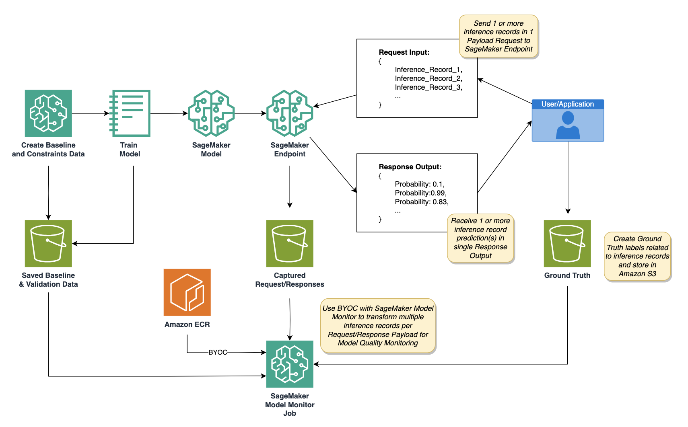

## Customized Model Monitoring for Near Real-time Batch Inference with Amazon SageMaker

This AWS code sample will demonstrate how to use Amazon SageMaker Model Monitoring when sending a “batch” of multiple inference records to an Amazon SageMaker Endpoint. Model Quality is chosen as the Model Monitoring method for this example. 

Amazon SageMaker Model Monitor monitors the quality of Amazon SageMaker machine learning models in production. Early and proactive detection of these deviations enables you to take corrective actions, such as retraining models, auditing upstream systems, or fixing quality issues without having to monitor models manually or build additional tooling. Model Monitor provides monitoring capabilities for: (a) data quality, (b) model quality, (c) bias drift in model's predictions, and (d) drift in feature attribution. 

### Steps

1. An AI/ML Developer will train an Amazon SageMaker Model and create Model Quality Baseline artifacts (e.g. F1-Score, Accuracy of model) and save to S3
2. An AI/ML Developer will create an Amazon SageMaker Endpoint with SageMaker Model and enable data capture
3. User/Application will send 1 payload with multiple inference records to an Amazon Endpoint. The user will receive a single payload response showing the output per inference record.  Since there are multiple inference records per request, we would need to parse the metric/statistic for every payload (containing multiple inference records ) for model quality.
4. User/Application will create ground truth data given predictions and store to Amazon S3
5. A SageMaker Model Monitor Job using a BYOC will be created to:
    1. Process the “batch” records to single records from Capture Request/Responses
    2. Merge step (A) with ground truth data submitted by user
    3. Compare evaluation of (A) and (B) with baseline data artifacts from step (1)
    4. Update the calculated metrics in Amazon Cloudwatch and output constraint violations report (if violations are present)

By executing the above steps, we show Amazon SageMaker users how to utilize a BYOC approach for Model Quality Monitoring (MQM) for the “batch” near time inference with an Amazon SageMaker endpoint, and how to create your own logic given custom business requirements. 

## How to execute the notebook?

Clone the repositiory and run the notebook `sm-mm-byoc-multi-payload.ipynb` with notebook kernel set to `Data Science 3.0 Kernel` with a recommended `ml.t3.medium` instance. 

## License

This library is licensed under the MIT-0 License. See the LICENSE file.